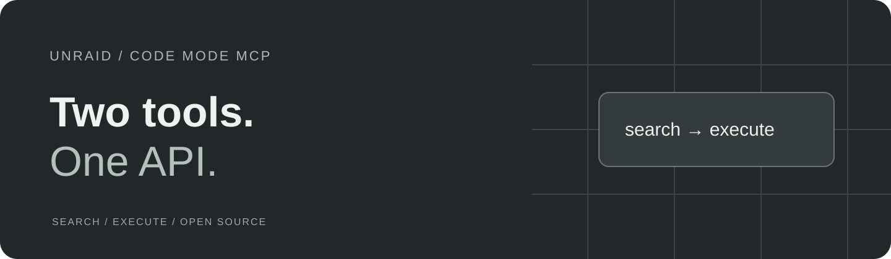

<p align="center">
  
</p>

<p align="center">
  <strong>Inspect your Unraid server through two MCP tools.</strong><br>
  Search the GraphQL schema, then query or change your server with sandboxed JavaScript.
</p>

<p align="center">
  <a href="#get-started">Get started</a> ·
  <a href="#example-session">Example session</a> ·
  <a href="#know-the-boundaries">Boundaries</a> ·
  <a href="CONTRIBUTING.md">Contribute</a>
</p>

<p align="center">Node.js 22.19+ · Public beta · v0.1.0-beta.3 · MIT license</p>

[](https://github.com/jmpijll/unraid-code-mode-mcp/actions/workflows/ci.yml)

## Two tools, one API

This [Model Context Protocol](https://modelcontextprotocol.io/) server exposes `search` and `execute`.
The agent searches the API reference, then runs JavaScript inside a QuickJS WASM sandbox.
API calls go through the host; credentials remain outside the sandbox.

- **Search the schema.** Introspection with a bundled SDL fallback.
- **Call typed operations.** `unraid.local.query.*` and `unraid.local.mutation.*`, plus raw GraphQL.
- **Batch independent reads.** Sequential `await` and `Promise.all` use the Promise-callback host bridge.
- **Choose credentials per request.** Environment variables for stdio; `X-Unraid-*` headers for HTTP.

## Get started

Install from source and point your MCP client at the built `dist/index.js`.

### Requirements

- Node.js **22.19.0 or newer** and npm. CI checks Node 22 and 24.
- Unraid 7.2+ with an API key and a reachable GraphQL API.

### Build from source

```bash
git clone https://github.com/jmpijll/unraid-code-mode-mcp.git
cd unraid-code-mode-mcp
npm ci
cp .env.example .env
# Edit .env: UNRAID_BASE_URL and UNRAID_API_KEY.
npm run build
npm start
```

The shell examples use Bash. In PowerShell, use `Copy-Item .env.example .env` and
set variables with `$env:NAME = 'value'`.

Configure your MCP client with `node /absolute/path/to/unraid-code-mode-mcp/dist/index.js`.
Use an absolute path and supply credentials through the client's environment configuration
when its working directory does not contain your `.env` file.
See the [client setup and usage guide](docs/usage.md).

For hosted use, set `MCP_TRANSPORT=http` and follow the [per-request credential contract](docs/multi-tenant.md).
Docker instructions are in [docker-compose.yml](docker-compose.yml).

## Example session

After discovering the operation with the search tool, use the execute tool:

```javascript
const info = await unraid.local.query.info({ fields: 'os { distro release kernel }' });
return info;
```

See the [usage guide](docs/usage.md) for search recipes, configuration and additional call shapes.

## Know the boundaries

| Area | Current boundary |
| --- | --- |
| API coverage | Local GraphQL only; `unraid.connect.*` is reserved and not implemented. |
| Mutations | VM start/stop was historically verified; other mutations need separate validation. |
| Workers | Scaffold; full MCP transport is not implemented. |
| Sandbox | Resource limits bound each invocation; allowed API calls still act with the supplied account's permissions. |

### Verification status

Earlier maintainer runs cover one Unraid 7.2 box, VM start/stop, cursor-agent and an opencode schema-only run. The opencode live execute run encountered an upstream CSRF failure. Hosted multi-tenancy and other hardware remain unverified.
See the [setup and verification reference](docs/usage.md#setup-and-verification-reference)
for the detailed historical evidence and remaining work. New verification reports should
identify the server revision, client, upstream version and operations actually exercised.

### Project status

Public beta · v0.1.0-beta.3. Install from source; the package remains private and is not published to npm.

## Privacy

The host sends API requests to the service configured for this server. Tool results and
captured sandbox logs are returned to your MCP client; that client may send them to its
configured model provider. Spec caches may be written locally.

Keep `.env` files and credentials private. Redact account identifiers, IP addresses and
service data before sharing logs or verification reports. See [SECURITY.md](SECURITY.md)
for vulnerability reporting.

## Development and contribution

```bash
npm run check
```

`check` runs lint, formatting, typecheck, mocked tests and the build.
It also verifies the built MCP server version and its two tools without tenant credentials
or upstream network access. `npm run cf:check` validates the Worker bundle without deploying it. See [CONTRIBUTING.md](CONTRIBUTING.md)
for the repository layout and contribution checks, and [AGENTS.md](AGENTS.md) for
architectural invariants. Live API tests require separate credentials and verification scope.

<a id="roadmap"></a>
<a id="verifying-your-install"></a>

## Documentation

- [Usage and client setup](docs/usage.md)
- [Architecture](docs/architecture.md)
- [Agent operating manual](SKILL.md) and [example persona](examples/unraid-expert-agent/)
- [Changelog](CHANGELOG.md)

## License and acknowledgements

[MIT](LICENSE). Built with TypeScript, the MCP SDK and QuickJS, following the
[Cloudflare Code Mode pattern](https://github.com/cloudflare/mcp-server-cloudflare).
